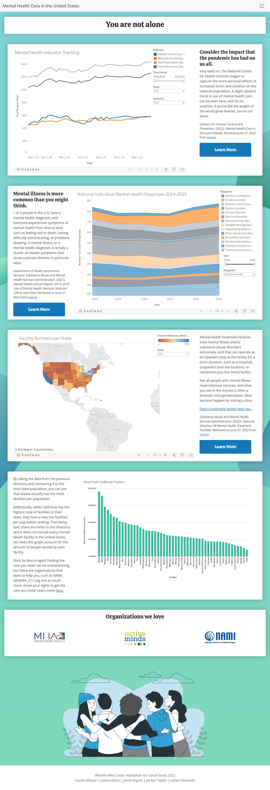

<!-- ### This is a readme file, woowee -->
# You're Not Alone: Mental Health Data in the U.S.
### The Project:
You’re Note Alone: Health Data in the US is a single page web app focused on bringing education and resources around mental health to the public. 

### What we did:
We strived to build a colorful, intuitive and interactive web application showcasing data visualizations aimed at creating visibility and reducing the stigma around mental health and mental illness. 

### Why this matters:
The application combines information from several sources, some of which can be lengthy reports, to displays multiple visualizations accompanied by educational captions and resources aimed to show that there are others experiencing, treating, and caring for their mental health, and they are not just a statistic. It also encourages people to seek help, facilitate coalition building, and influence policy change.

# The Team:
- Laurel Mossor: Team Lead and Back-end Developer
- Jennifer Argote: Front-end Web Developer
- Leilani Quesada: Front-end Web Developer 
- Jolene Glenn: Data Analytics and Visualization
- Jordyn Taylor: Project Analyst and general support

### Instructions for using this file
- Within the main hackathon-for-social-good directory:
    - $pip3 install -r requirements.txt
    - Activate the virtual environment w/ $source env/bin/activate
    - Start the server w/ $python3 server.py

